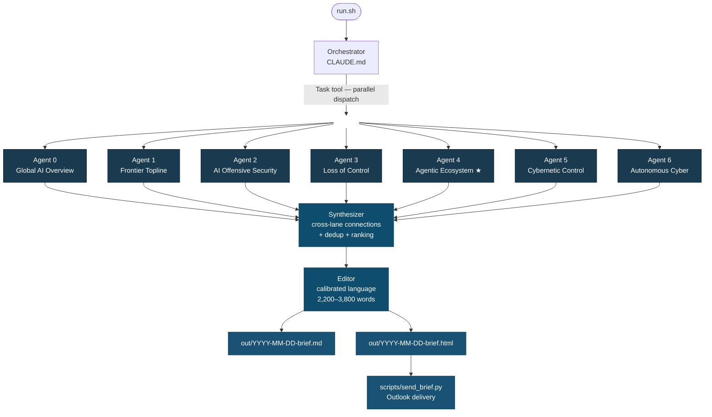

# Out of Distribution — Daily AI Risk & Security Brief

A multi-agent research orchestration system that produces a daily intelligence brief on AI risk, safety, and security. Seven specialized agents run in parallel, a synthesizer finds cross-lane connections, and an editor produces a polished brief. 



## What it does

Every day, seven specialized research agents run in parallel across distinct intelligence lanes — each doing 15-20 web searches and fetching primary sources. A synthesizer then finds cross-lane connections and deduplicates. An editor produces a polished brief in markdown and HTML. The whole pipeline runs inside Claude Code using the Task tool for parallel agent dispatch.

## Intelligence lanes

| Agent | Lane |
|-------|------|
| 0 | Global AI overview — what happened in AI today, no filter |
| 1 | Frontier topline — major lab announcements, new models, capability evals |
| 2 | AI-enabled offensive security — LLM-powered attacks, prompt injection, SOC pressure |
| 3 | Loss of control & alignment — scheming evals, deceptive alignment, interpretability, corrigibility |
| 4 | Agentic ecosystem *(priority lane)* — MCP/A2A security, agent infrastructure, multi-agent risks |
| 5 | Cybernetic & control-theoretic AI safety — Ashby, Lyapunov, safe interruptibility, AI control agenda |
| 6 | Autonomous cyber — offense/defense evals, agent escape, machine-speed defense, AI-vs-AI red team |

## Quick start

**Prerequisites:** [Claude Code](https://docs.anthropic.com/en/docs/claude-code) installed and authenticated.

```bash
git clone https://github.com/Greenboat11/out-of-distribution-brief
cd out-of-distribution-brief

# Configure recipient
echo 'BRIEF_RECIPIENT=you@example.com' > .env

# Run interactively (Claude Code reads CLAUDE.md and executes the full pipeline)
./run.sh

# Or headless (for cron)
./run.sh --headless
```

## Scheduling

```bash
# Install a weekday 3pm cron job
bash setup-schedule.sh
```

## Project structure

```
out-of-distribution-brief/
├── CLAUDE.md                          # Orchestrator instructions for Claude Code
├── run.sh                             # Entry point
├── setup-schedule.sh                  # Cron job installer
├── agents/
│   └── topical-agent.md              # Template given to each of the 7 topical agents
├── sources/
│   ├── agent-0-global-overview.md    # Per-lane source lists and search guidance
│   ├── agent-1-frontier-topline.md
│   ├── agent-2-ai-offensive-security.md
│   ├── agent-3-loss-of-control.md
│   ├── agent-4-agentic-ecosystem.md  # Priority lane
│   ├── agent-5-cybernetic-control.md
│   └── agent-6-autonomous-cyber.md
├── scripts/
│   └── send_brief.py                 # HTML email delivery via Outlook
├── state/
│   ├── last_run.json                 # Timestamp and item counts from last run
│   └── recent_items.jsonl            # Rolling 7-day item hashes for dedup
└── out/                              # Generated briefs (gitignored)
```

## How it works

The orchestrator (`CLAUDE.md`) instructs Claude Code to:

1. Check `state/last_run.json` to determine the lookback window (24h default, expands if run was skipped)
2. Spawn all 7 topical agents in **parallel** via the Task tool, each with the `agents/topical-agent.md` template plus its lane-specific source list
3. Each agent does 15-20 web searches, fetches primary sources, and returns a structured JSON blob: `headline_items`, `secondary_items`, `weak_signals`, `sources_consulted`
4. The **synthesizer** receives all 7 blobs, finds cross-lane connections, demotes duplicates, and ranks items
5. The **editor** produces final markdown and HTML with calibrated language (no "exciting" or "groundbreaking"), direct source links, and a hard 3,800-word ceiling
6. State files are updated, and the brief is emailed via `scripts/send_brief.py`

## Email delivery

On Windows with Outlook installed:

```bash
pip install pywin32
echo 'BRIEF_RECIPIENT=you@example.com' > .env
python scripts/send_brief.py

# Preview without sending
python scripts/send_brief.py --dry-run
```

## Customization

- **Add or modify lanes:** Edit the relevant `sources/agent-N-*.md` file and update the agent table in `CLAUDE.md`
- **Change search depth:** Adjust the search count guidance in `agents/topical-agent.md`
- **Adjust output format:** Edit the editor instructions in `CLAUDE.md`
- **Change schedule:** Edit `RUN_TIME` in `setup-schedule.sh`

## Design principles

- **No hallucinated citations.** Every claim must link to a fetched URL. If it can't be verified, it doesn't appear.
- **Calibrated language.** "Apollo published" ≠ "an unreviewed preprint argues." Verbs match evidence level.
- **Honest gaps.** Empty lanes say so. No padding.
- **Cross-pollination as first-class output.** The synthesizer's job is finding non-obvious connections between lanes.
- **Source diversity over source volume.** One high-signal preprint beats ten blog rehashes.
